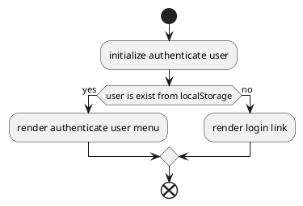

# Boilerplate react application

This boilerplate react application was created using `create-react-app` and configured with the options as described in the original `README.md` file

## Setup

To setup the project, check it out and init the dependencies using `yarn install`.

## Commands

# Start the development server using

yarn start

# Start the test runner

yarn test

## Enabled features

- Linting output in the editor `.eslintrc`
- Automatic code formatting using prettier
- SASS stylesheets
- Testing with Jest and Enzyme

## Note

If you inspect browser to detect on mobile please press F5 to make sure render on mobile run properly

## Work flow render login



## Work flow login authenticate for user

```plantuml
@startuml
start
    :user click login;
    :open modal login;
    if(user enter user name and password) then(yes)
        :click button sign in
            if(status is success) then (yes)
                :close modal login;
                :save user to storage;
                :render authenticate user menu;
            else (no)
                :throw error;
        endif;
    endif;
end
@enduml
```
